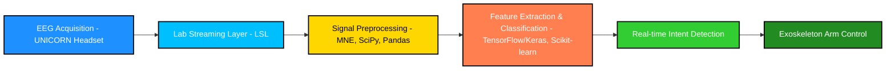

  

 

# 🧠 BCI-based Upper Limb Exoskeleton Controlled by EEG Signals

  
  

  

 

**Graduation Project — Nile University**  
🎓 **Grade: A+**

---

## 📖 Introduction
This project presents a **Brain–Computer Interface (BCI) system** for controlling an **upper limb exoskeleton** using real-time **EEG signals**. The system integrates **EEG intent-classification pipelines**, advanced **machine learning models**, and a **robotic exoskeleton** to aid in **neurorehabilitation**.  

By decoding motor imagery tasks from EEG data, the exoskeleton responds to patient intent in near real-time, offering a practical solution for **stroke rehabilitation** and **motor recovery therapies**.

---

## 🎯 Aim & Motivation 
- Our rehabilitation system comprises two subsystems – the mechanical and BCI systems – working in harmony to optimize the rehabilitation process.
- The mechanical and BCI systems operate together, fostering a cooperative approach that enhances targeted and adaptive rehabilitation for improved patient outcomes.
- Through progressive training, our system empowers patients to regain independence, leading a normal life and reducing reliance on external assistance.

---

## 📑 Table of Contents
- [Introduction](#-introduction)
- [Aim & Motivation](#aim-&-motivation) 
- [Features](#-features)  
- [Tech Stack](#tech-stack)   
- [Exoskeleton Arm Requirements](#exoskeleton-skeleton-requirements)
- [Hardware Components](#hardware-components)
- [Mechanical Design](#mechanical-design)
- [System Architecture](#system-architecture)  
- [Examples](#-examples)  
- [Troubleshooting](#-troubleshooting)  
- [Contributors](#-contributors)  
- [License](#-license)  

---

## 🚀 Features
- ⚡ **Real-time EEG intent-classification** for exoskeleton arm control.  
- 🤖 **Integration with UNICORN Hybrid Black EEG headset** via Lab Streaming Layer (LSL).  
- 🧩 **Multi-class EEG motor imagery detection** (feet, left hand, right hand, tongue).  
- 📊 Achieved **78% classification accuracy** *(Cohen’s κ = 0.71)*.  
- 🔬 **Signal preprocessing pipeline** with filtering, artifact removal, and feature extraction.  
- 🔗 **MATLAB Engine API integration** for enhanced computation and visualization.  
- 🏥 Application in **neurorehabilitation and assistive robotics**.  

---

## 🛠️ Tech Stack 

- **Programming & ML Frameworks** 

         

- **Data Visualization & Processing**

         

- **Machine Learning & Statistics** 

        

- **MATLAB Integration**  
  

- **Real-time Streaming & Hardware**  
  - Lab Streaming Layer (LSL)  
  - UNICORN Hybrid Black EEG headset  
  - Exoskeleton Arm  

---

## 🤖 Exoskeleton Arm Requirements 
| Requirement               | Features                                                                                                                                                                             |
|--------------------------|---------------------------------------------------------------------------------------------------------------------------------------------------------------------------------------|
| **Safety**               | - Aligning with natural arm movements   - Setting force limits   - Ensuring precise control for accurate and controlled movements                                               |
| **Comfort**              | - Prevent arm fatigue   - Focusing on well-transmitted forces   - Balanced torques around joints   - Secure attachment to avoid slipping                                     |
| **Easy Wearability**     | - Comfort and freedom of movement   - Avoiding need for specific starting poses   Minimizing bulkiness and be lightweight   - Providing Adjustment for different arm sizes   |

---

## 💻 Hardware Components 
| Component               | Features                                                                 |
|--------------------------|---------------------------------------------------------------------------|
| **Raspberry Pi**         | - Signal processing   - Machine Learning Integration                  |
| **Servo Motor (35.5 KG)**| - Relatively High Torque Capacity   - Movement of the Elbow            |
| **Servo Motor (MG995)**  | - Relatively Medium Torque Capacity   - Movement of the Wrist          |
| **Force Sensor**         | - Arm Weight Measuring                                                   |
| **MPU6050 Accelerometer**| - Motion Measurements   - Feedback for Control Algorithm               |

---

## ⚙ Mechanical Design 
<table align="center">
  <tr>
    <td align="center">
       
      <b>Top View</b>
    </td>
    <td align="center">
       
      <b>Isometric View</b>
    </td>
  </tr>
  <tr>
    <td align="center">
       
      <b>Front View</b>
    </td>
    <td align="center">
       
      <b>Side View</b>
    </td>
  </tr>
</table>

## 🛠️ System Architecture 

